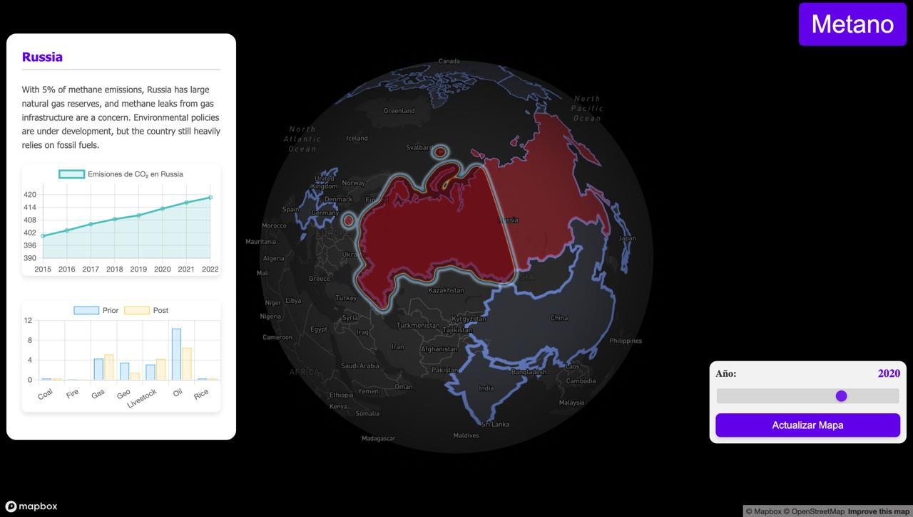

# Proyecto de Visualización de Emisiones de Metano y CO₂

Este proyecto permite visualizar datos relacionados con las emisiones de metano y CO₂ en un mapa interactivo utilizando **Mapbox** y **Chart.js**. Se proporciona una interfaz gráfica para explorar las emisiones de diferentes países y obtener información detallada.

## Contenido

- **Mapa Interactivo**: El archivo `mapa.html` permite visualizar las emisiones de metano y CO₂, alternando entre ambos mapas.
- **Datos**: Los datos necesarios para el funcionamiento del proyecto se encuentran en Google Drive. [Accede a la carpeta de datos aquí](https://drive.google.com/file/d/1CknBLDKD2iCemTR90x8aQQfHr4SJLGuJ/view?usp=sharing).
- **API**: El proyecto incluye una API para la obtención de datos sobre emisiones. Asegúrate de tener el servidor corriendo para que las llamadas a la API funcionen correctamente.

## Instrucciones de Uso

1. **Descargar los Datos**:
   - Descomprime los datos de la carpeta de Google Drive en el directorio del proyecto.
   - Asegúrate de que los archivos de datos estén en la ruta correcta.

2. **Configuración del Servidor**:
   - Asegúrate de que el servidor de la API esté corriendo en `http://localhost:3000`.
   - Puedes usar herramientas como `ngrok` para exponer tu servidor local a internet si es necesario.

3. **Ajustar Rutas (si es necesario)**:
   - Si cambias la estructura de carpetas o los nombres de los archivos, ajusta las rutas en el código JavaScript dentro de `mapa.html`.

4. **Abrir el Mapa**:
   - Abre el archivo `mapa.html` en un navegador para visualizar el mapa interactivo.
   - Usa el botón "CO₂" para alternar entre los mapas de emisiones de metano y CO₂.

## Categorías y Clases de Metano

Las emisiones de metano se pueden clasificar en las siguientes **categorías** y **clases**:

### Categorías
- **Prior**: Datos de emisiones previos a las políticas o acciones específicas implementadas.
- **Post**: Datos de emisiones después de la implementación de políticas o acciones específicas.

### Clases
- **Coal**: Emisiones provenientes de la extracción y uso del carbón.
- **Fire**: Emisiones generadas por la quema de biomasa.
- **Gas**: Emisiones relacionadas con la producción y uso del gas natural.
- **Geo**: Emisiones de fuentes geotérmicas.
- **Livestock**: Emisiones generadas por la cría de ganado y otros animales.
- **Oil**: Emisiones derivadas de la extracción y uso del petróleo.
- **Rice**: Emisiones asociadas al cultivo de arroz.

## Rango de Años para CO₂

El mapa interactivo permite la selección de años para las emisiones de CO₂ en el rango de **2015 a 2022**. Puedes ajustar el año utilizando un control deslizante, lo que permite visualizar las emisiones para un año específico dentro de este rango.

## Funcionamiento

- El mapa de **metano** se muestra por defecto al abrir el archivo.
- Al hacer clic en un país, se muestra un popup con información sobre las emisiones de CO₂ y metano para ese país.
- Se pueden seleccionar diferentes categorías y clases de emisiones mediante un menú desplegable.
- Los gráficos de emisiones para el país seleccionado se muestran en el popup utilizando **Chart.js**.

## Demo

A continuación se muestran algunas imágenes de la visualización de los datos:

## Requerimientos

- Navegador web moderno (se recomienda Google Chrome o Firefox).
- **Mapbox Access Token**: Asegúrate de reemplazar el `mapboxgl.accessToken` en el código con tu propio token de acceso de Mapbox.

## Contribuciones

Si deseas contribuir al proyecto, por favor abre un issue o envía un pull request.

## Licencia

Este proyecto está bajo la Licencia MIT.
