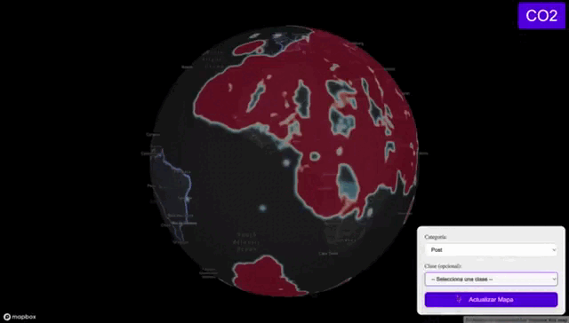

# Methane and CO₂ Emissions Visualization Project

This project allows users to visualize data related to methane and CO₂ emissions on an interactive map using **Mapbox** and **Chart.js**. A graphical interface is provided to explore emissions from various countries and retrieve detailed information.

## Table of Contents

- **Interactive Map**: The `mapa.html` file enables visualization of methane and CO₂ emissions, allowing users to toggle between the two maps.
- **Data**: The data required for the project is hosted on Google Drive. [Access the data folder here](https://drive.google.com/file/d/1CknBLDKD2iCemTR90x8aQQfHr4SJLGuJ/view?usp=sharing).
- **API**: The project includes an API to fetch emission data. Make sure the server is running for API calls to function correctly.

## Usage Instructions

1. **Download the Data**:
   - Unzip the data from the Google Drive folder into the project directory.
   - Ensure the data files are placed in the correct path.

2. **Server Setup**:
   - Make sure the API server is running at `http://localhost:3000`.
   - Tools like `ngrok` can be used to expose your local server to the internet if necessary.

3. **Adjust File Paths (if necessary)**:
   - If you change folder structures or file names, adjust the paths in the JavaScript code within `mapa.html`.

4. **Open the Map**:
   - Open the `mapa.html` file in a web browser to view the interactive map.
   - Use the "CO₂" button to toggle between methane and CO₂ emission maps.

## Methane Categories and Classes

Methane emissions can be classified into the following **categories** and **classes**:

### Categories
- **Prior**: Emission data before the implementation of specific policies or actions.
- **Post**: Emission data after the implementation of specific policies or actions.

### Classes
- **Coal**: Emissions from coal extraction and use.
- **Fire**: Emissions generated by biomass burning.
- **Gas**: Emissions related to the production and use of natural gas.
- **Geo**: Emissions from geothermal sources.
- **Livestock**: Emissions generated by livestock farming.
- **Oil**: Emissions derived from oil extraction and use.
- **Rice**: Emissions associated with rice cultivation.

## CO₂ Year Range

The interactive map allows the selection of CO₂ emission data for the range of **2015 to 2022**. You can adjust the year using a slider, enabling the visualization of emissions for a specific year within this range.

## Functionality

- The **methane** map is displayed by default when opening the file.
- Clicking on a country shows a popup with information about CO₂ and methane emissions for that country.
- Different emission categories and classes can be selected through a dropdown menu.
- Emission charts for the selected country are displayed in the popup using **Chart.js**.

## Demo

Below are some screenshots of the data visualization:

## Requirements

- A modern web browser (Google Chrome or Firefox is recommended).
- **Mapbox Access Token**: Make sure to replace the `mapboxgl.accessToken` in the code with your own Mapbox access token.

## Contributions

If you wish to contribute to the project, please open an issue or submit a pull request.

## License

This project is licensed under the MIT License.
